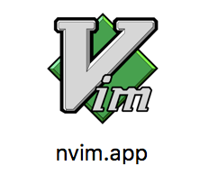

# vim-finder

An AppleScript that opens vim or nvim.

- Changes the current working directory to the folder of the file opened
- Opens either nvim or vim (depending on the version used)
- Closes the Terminal after closing vim/nvim

# How to use

- Open Automator
- Create a new **Application**
- Add a step **Run AppleScript**
- Paste the desired script into it and save as a `.app` application file
- Move to the Applications folder and use it to open files
